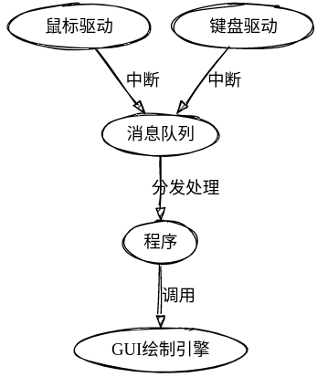

## 环境配置
```bash
# ubuntu 20.04
sudo apt install qemu
sudo apt install qemu-system-i386
```


## 命令式文本编辑器

### 运行

```bash
git checkout master
make
make qemu-nox
editor [filename]
```


### 命令支持

|  Command   |       Action       |
| :--------: | :----------------: |
|   ins-n    |  在第n行插入一行   |
|    ins     |   在最后一行插入   |
|   mod-n    |     修改第n行      |
|    mod     |    修改最后一行    |
|   del-n    |     删除第n行      |
|    del     |    删除最后一行    |
|    show    | 启用修改后自动显示 |
|    hide    | 禁用修改后自动显示 |
| highlight  |    启动自动高亮    |
| nhighlight |    禁用自动高亮    |
|    save    |      保存文件      |
|    exit    |     退出编辑器     |
|    help    |    显示帮助信息    |
|  rollback  |      回滚文件      |
|   print    |    打印文件内容    |


## GUI文本编辑器

### 运行

> 在屏幕上双击Editor应用程序或者文本文件进行编辑

```bash
git checkout master
make
make qemu
```


### 功能支持
- [x] 光标及鼠标使用
- [x] 使用上下左右键切换光标位置
- [x] 使用Home，End键回到行首行尾
- [x] 使用Ctrl-Home回到文件最开始位置
- [x] 使用Ctrl-End回到文件最结尾位置
- [x] 使用Ctrl-C复制，Ctrl-V 粘贴，Ctrl-X 剪切
- [x] 使用Shift加上下左右、Home、End键进行自由选择
- [x] 使用Ctrl-A全选
- [x] 支持c语言的自动高亮显示
- [x] 使用Ctrl-Z，Ctrl-Shift-Z进行撤销和反撤销
- [x] 使用Ctrl-S保存文件
- [x] 使用Ctrl-F进行搜索和替换，使用Tab和Shift+Tab可以在搜索框和替换框中切换，使用Enter键进行替换操作，使用Esc键退出
- [x] 使用Ctrl-+/-，放大或缩小字体大小
- [x] 使用Ctrl-`调出内嵌终端，可以在里面执行命令，使用Esc键退出


## 模块架构



鼠标驱动和键盘驱动通过中断生成对应消息，置入消息队列后，分发到程序（文本编辑器）进行处理，通过调用GUI绘制引擎更新界面


